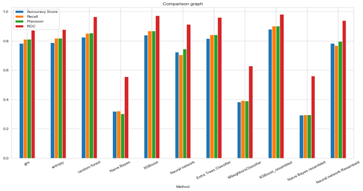
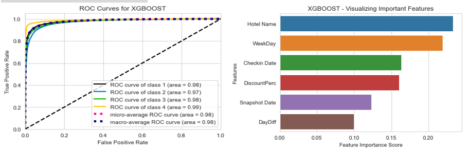
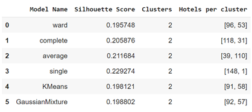
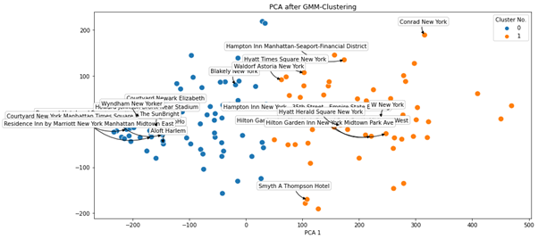
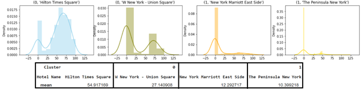
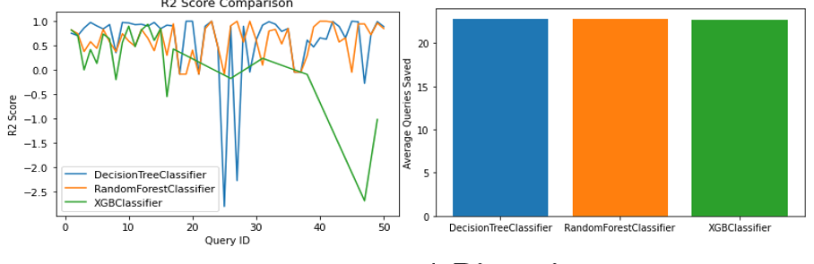

# Pricing policy for hotels

The modern world is intense, so despite the Coronavirus pandemic, people are still likely to enjoy their holidays away from home, ideally in a hotel. When guests stay in high-rank hotels, the facilities, comfort, and tasty meals are among the benefits they enjoy. The staff also does its best to meet the needs of every guest. When ordering a hotel room, there are several factors to take into consideration. In addition to those who have mentioned, the price of a hotel is another core consideration. Although luxury hotels are luxurious and enjoyable, one cannot afford to stay in them if the cost is too high. In fact, the better the hotel's experience is, the higher the check-in price will be. We would, however, like to improve the prices for booking hotels by analyzing their booking data, understanding their pricing policies, and predicting the best prices using discount codes.  Allowing people to save money while enjoying their stay in a fine and enjoyable hotel.

The project examines the pricing policies of hotels in New York. In the dataset itself, there are listed hotels and the general information concerning them, such as their name and rating, check-in date, number of days to stay, original price, discount price, as well as a snapshot date and ID indicating when the data was taken.
In this study, we are looking to identify the hotels' pricing policies through the analysis of different techniques. Discounts in hotel prices - There are four discount codes (ranging from one to four), each giving a certain amount of discount. For this objective, the best discount code is determined by using classification algorithms which predict the code offering the best discounts. To identify groups of hotels with similar pricing policies, clustering algorithms are used. As a result, it is possible to predict the price of hotels without big data, using comprehensive data about other hotels in the same group and similar pricing policies.

There is a data cost - Some datasets cannot be obtained for free, and sometimes, to obtain material that is worthwhile, a substantial sum of money is required. An Active Learning algorithm can help in this case by learning about which queries we are the most uncertain about (uncertainty sampling - uncertain about sample price), and for those queries, we will query and pay for their labeled price. Therefore, we will not be paying for every query, but the most uncertain ones only. By calculating a hotel's check-in price based on the paid data, we can predict the price of queries we are more certain about, thus saving money on some less certain and more vital queries for the prediction of the rest.

## Experimental results
**Data Preparation** - As a first step, we add a few additional columns: days between the check-in date and snapshot date (DayDiff), day of the week (WeekDay), a discount difference (DiscountDiff), and discount percentage (DiscountPerc). Following this, we used BoxPlot and Scatter Matrix to visualize the data distribution, and a log function to normalize discount columns. Lastly, we removed outliers from the data. As can be seen in the new BoxPlot and  Scatter Matrix, the preparation has improved the distribution. All the graphs we produced during the preparation can be found here.

**Classification** - To prepare the data for classification, the maximum discount code was used to group the data. In the next step, we encoded string data (hotel name, week day, snapshot date, check-in date) using Label Encoder. Finally, we resampled the data in order to achieve a balanced representation of discount codes. After the preparation process, the data were split into a train set (0.7) and a test set (0.3), then the data were cross-validated (5) to determine the best classifier (with the highest accuracy score). As part of this process, we run each classifier using our 'Search grid' to improve the results via the best parameters for each classifier. Our methodology for assessing each classifier (listed in section 2.1) includes visualizing and expressing the confusion matrix, and ROC graph, also we print the important features (the features that influence the classifier the most). To compare the performance score of the classifiers, we used several different metrics such as accuracy, recall, precision, and ROC. We resampled the data to improve the performance and repeated the above processes with XGBoost, Naive Bayes, and a Neural Network.

In the end, we produced the following comparison graph that allows us to understand the score of each classifier and method:

The resampled XGBoost is the best classifier as demonstrated in the graph. This is its ROC and the feature influence graphs:

**Clustering** - In preparation for clustering, we filtered the most appearing hotels in the data (top 150). After that, we filtered check-ins with the highest appearances (top 40), providing enough data to cluster. As a last step, we normalized the price data. Following the preparation phase, we used various clustering models to create the data set - agglomerative with the following methods: ward, complete, average, and single (we produced a dendrogram for each, it can be found here: Dendrogram), as well as K-Means and Gaussian Mixture. We used the Silhouette Score and the number of clusters to compare the model's performance (as shown in the table above).
We also try PCA before and after. These are the clusters with PCA after GMM:

Below is the price distribution for 4 random hotels (2 of each cluster), as can be seen each cluster has distinctive prices:

**Active Learning** - Data (Hotels_data_changed) from the prepared dataset was used as the base dataset, and only the top 40 hotels with the most data were analyzed. Our active learner model was fitted with Decision Tree, Random Forest, and XGBoost classifiers as estimators with a query strategy of uncertainty sampling in which we sample the queries we are least certain about, saving money on more certain queries. Based on the learner score and R2 score, the results from this study were collected and stored in an excel file (Active Learning Results). Following that, we calculated how many queries were saved by each algorithm. In the next two graphs, we display only the top 50 queries for display purposes. As can be seen, although the R2 score has shown a difference between the models (as will be explained in the discussion section) The average queries saved by each model are about the same.

## Discussion
Using a variety of clustering models, we attempted and succeeded in finding hotels with similar pricing standards. The GMM model was the best clustering model for our data, followed by the K-Means model. By using a PCA to analyze the data and printing statistical functions on two hotels from each cluster, it becomes evident that the average price of hotels differs among clusters. There are two main pricing policies indicated by the clustering graphs, and one group of hotels is cheaper than the other (as shown by the average price we took on samples from each cluster).

In addition, when we looked at the original dataset after taking the two samples from each cluster, we discovered that the two samples with the lowest average belonged to 3-star rated hotels, while the two samples with higher averages belonged to 5-star rated hotels. In other words, the division we received based on prices reflects the reality of hotels with high and low ratings and the price reflects the rating. There are probably some four-star hotels that are more similar in price to five-star hotels and some that are more similar to three-star hotels, and these are the overlap points in the two clusters (in the graph we printed). The points that are far from each other probably refer to hotels with three or five stars, not four.

Using classification, we determine what is the best discount code. As shown in the results, the best classification model was XGBoost. Also, after resampling, the results of the best model (XGBoost) got better, and the results for the worst model (Naive Bayes) have become less good. This can be explained, in our opinion, very simply. The best algorithms comprehend the data from the beginning, so the answers are almost always correct. The data is more balanced after resampling, thus providing better results. Conversely, the worst algorithms are not suitable for this type of data in the first place and the reason this gets worse is that with more balanced target classes, the chances of giving a correct answer decreases because if it was unbalanced then it might fall on a right answer by chance.

According to us, the naive assumption of the Naive Bayes algorithm (its name derives from this assumption), that there is no dependence between the properties/features of the classified objects once their classification is already known. This assumption is incorrect in our case. There is a connection between the different features and this assumption causes the algorithm to give us bad results. Despite its poor results, its training phase was the fastest of all - for data that suits it, it would be beneficial to use it. There are other algorithms whose results were not the best but their runtime was very fast (as we expected, according to the general approach).

Based on Active Learning results, the Decision Tree and Random Forest classifiers scored about the same while XGBoost trails behind.  Although there were different scores, the average number of queries saved by each classifier was the same (20). There were not many data points, which can explain the difference between the models' performances. The query that produced the biggest train set yielded 44 lines, while the others yielded even fewer. As XGBoost, unlike the former, cannot be demonstrated fully where there is insufficient data to train it.

## Code
This code is divided up into six separate Colab notebooks. Each of them will be briefly described here. 
* **DataPreparation.ipynb** - Here is the first step in preparing the data, and understanding what the data looks like, as well as identifying and cleaning outliers in the data. 
* **ClusteringPreparations.ipynb** - Prepares a CSV file for clustering based on the problem definition. 
* **Clustering.ipynb** - This is where clustering and PCA are done, along with the graph prints. 
* **ClassificationPreparations.ipynb** - Creates two CSV files for classification, one before and one after resampling. 
* **Classification.ipynb** - This is where classification is done, along with the graph prints. 
* **ActiveLearning.ipynb** - This module attempts to model prices by sampling the most uncertain queries, creating a  CSV file holding the results, along with prints of relevant graphs.
